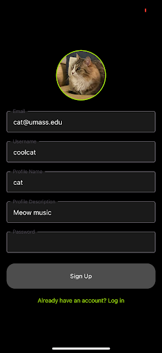

# Tunelink – React Native 

This project was bootstrapped with [React Native CLI](https://reactnative.dev/docs/environment-setup) and is powered by [Expo](https://expo.dev/).

## Overview

Welcome to the **Music Sharing App**! This app, built with React Native, allows users to share, explore, and interact with music-centric posts in a social media format, much like Instagram but dedicated to music lovers. This guide will walk you through the setup and usage of the application.

### Backend Setup  

First, set up and run the backend by following the instructions at [Tunelink Backend Repository](https://github.com/hannajiangg/TuneLink-server). 

### Prerequisites  

- **Node.js** installed on your machine  
- **npm** (comes with Node.js)  
- **Expo Go** app installed on your mobile device ([Android](https://play.google.com/store/apps/details?id=host.exp.exponent) / [iOS](https://apps.apple.com/app/expo-go/id982107779))  
- A smartphone with a camera to scan the QR code

### Clone the Repository  

git clone https://github.com/hannajiangg/TuneLink
cd tunelink-frontend

## Getting Started

Please read the .env file to set up the environment variables. You will need to replace the IP address with your own!

To install all dependencies for the project, you can run:

### ```npm install```

### ```npm start```

Scan the qr code througg the Expo Go app, or select the device type to display the simulation.

## Project Tech Stack

- **React Native**: Utilized as the mobile application frontend framework, enabling cross-platform development and ensuring a consistent user interface across iOS and Android devices.
- **Expo Go**: Serves as a mobile application emulator, streamlining development and testing by allowing real-time updates and debugging on various devices.
- **MongoDB**: A non-relational database used to store users and posts, providing a flexible and scalable solution for handling application data.
- **Swagger UI**: A tool to automatically visualize API documentation, improving development workflows and enabling easier collaboration between team members.
- **Express**: Used to create endpoints for RESTful APIs, ensuring a reliable and efficient backend for handling application requests and data interactions.


# How To Use the App

## Login/Sign Up  
The login and sign-up screen allows users to create a new account or log in to an existing one. During the account creation process, users can select their favorite music genres to personalize their experience. Once logged in, users are redirected to the feed screen, where they can start exploring and interacting with posts.

## Profile Screen
The profile screen is where users can view and manage their activity within the app. It displays their uploaded posts, including song titles, comments, and audio links. Users can also see their number of followers and following, providing an overview of their social interactions. Additionally, users can manage their profile and posts from this screen, ensuring their content stays organized and up-to-date.

## Search Screen  
The search screen is designed to help users discover content and connect with others in the community. Users can search for specific accounts by name or handle and filter results based on genres or other criteria. This screen enhances the app’s usability by simplifying the process of finding and exploring new users and content.

## Feed Screen  
The feed screen is the central space for browsing music-centric posts. Users can scroll through posts featuring videos with audio tracks, view details about who posted the content, and interact by liking or commenting on posts. This screen provides a dynamic and engaging way for users to discover and enjoy content shared by the community.

## Recommendation Algorithm  
The recommendation algorithm is a core feature of the app that personalizes the user experience. It curates posts based on the user’s selected genres during signup and interactions within the app. Additionally, it considers content shared by the user’s followers to ensure recommendations are relevant and engaging. This feature helps users discover new music and posts that align with their tastes and social connections.

## Post Button  
The post button allows users to contribute to the community by uploading new content. When creating a post, users can add a song title, write a comment, and provide an audio link to the content they are sharing. This feature enables users to actively engage with the app and share their favorite music or original creations.

# Images


<div align="center">
    
    
    
</div>

<div align="center">
    
    
</div>

<div align="center">
    
    
</div>

<div align="center">
    
</div>

<div align="center">
    
    
    
</div>
